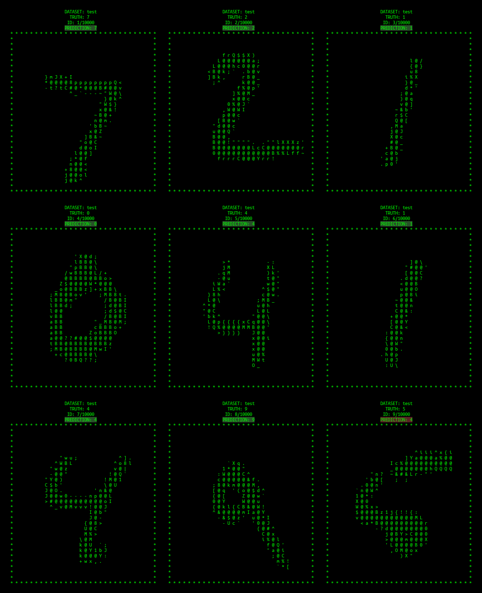
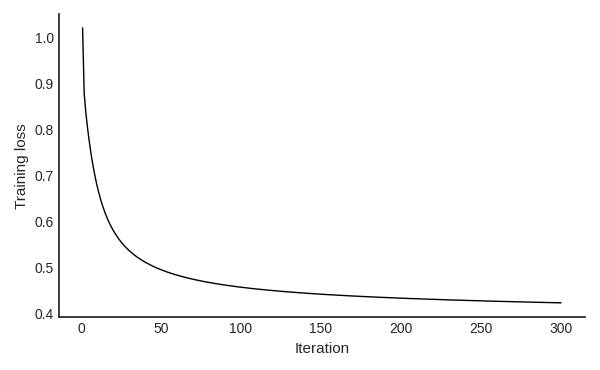
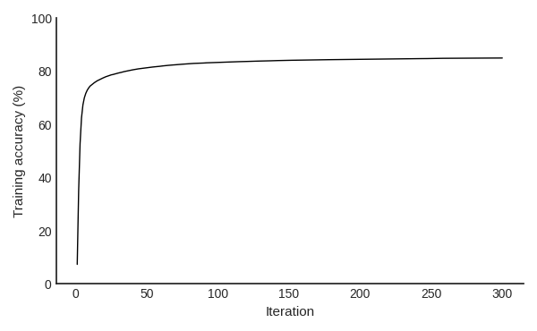

# MNIST from scratch in HIP

Digit classification with the MNIST dataset is used widely as a 'Hello World' problem in machine learning.
In the age of capable ML frameworks and abstractions, it is easier than ever to produce a working MNIST classifier.
While powerful, these can obscure the underlying mechanisms.

This small project aims to restore some of that view by implementing a simple MNIST linear classification model from scratch in HIP, tuned for Radeon Pro VII (gfx906).

<p align="center">
  
  <br>
  <sub>
    MNIST test dataset visualization and predictions (300 training iterations, learning rate 0.01).
  </sub>
  <br>
</p>


## Requirements
- AMD GPU (code is tuned for Radeon Pro VII)
- Compatible ROCm installation (see: https://rocm.docs.amd.com/en/latest/compatibility/compatibility-matrix.html)

    
## Build and run
```
make
./mnist ./dataset [iterations] [learning rate]
```

The optional arguments default to 100 iterations and learning rate of 0.01.


## Model

Let $X^{jk}$ denote images (training or test), where $j$ indexes the image, and $k$ indexes pixels (plus bias).
    
Let $W^{ik}$ denote model weights, where $i$ indexes digit class (0–9).

Repeated indices are implicitly summed and unique indices denote free matrix component labels.
We use all-up convention, so up/down indices carry no geometric significance.

Class scores are given by:

$$
\hat{Y}^{ij} = W^{ik} X^{jk},
$$

and loss by the average squared residual:

$$
L := \frac{1}{N}\lVert\hat{Y}^{ij} - Y_{\mathrm{true}}^{ij}\rVert_{\mathrm{F}}^{2},
$$

where $N$ is the number of images. Training proceeds by iterative update of the weights via gradient descent:

$$
\begin{aligned}
  W^{ik} &\leftarrow W^{ik} - \Delta \frac{\partial L }{\partial W^{ik}}\\
         &= W^{ik} - \frac{2 \Delta}{N} ( \hat{Y}^{ij} - Y_{\mathrm{true}}^{ij}) X^{jk},
\end{aligned}
$$

where $\Delta$ is the learning rate.


## Training loss and accuracy

On my card and with ROCm 6.4.3, this implementation achieved 84.8% training / 85.5% test accuracy in 300 iterations using learning rate 0.01, 4.18 ms / iteration.

<p align="center">
  
  <br>
  <sub>
    MNIST training loss over 300 iterations (learning rate 0.01).
  </sub>
  <br>
</p>
<p align="center">
  
  <br>
  <sub>
    MNIST training accuracy over 300 iterations (learning rate 0.01).
  </sub>
  <br>
</p>


## Optimizations

The majority of time in the training loop is spent in `sgemm_sub_and_scale` and `sgemm`, which roughly account for forward pass and back propagation, respectively.
The primary mathematical operation in each of these steps is a matrix multiplication.
Key performance considerations and optimizations incorporated in these functions are:
- data layout: format matrices to be amenable to coalesced memory accesses (e.g. transpose matrices)
- ping-pong buffering: overlap load of $k+1^{th}$ tile with compute of $k^{th}$ tile
- shared memory tiling: compute partial dot products in a way that optimizes data reuse
- hand-tuned tiling parameters
- occupancy tuning via launch bounds, thread, and block parameters
- loop unrolling (not always a win, but can help if it does not induce register spillage)
- warp shuffle reduction: avoid atomics contention
- kernel fusion: store $2(\hat{Y} - Y)$ during forward pass, in preparation for back propagation


## References

- MNIST dataset:
  - https://storage.googleapis.com/cvdf-datasets/mnist/train-images-idx3-ubyte.gz
  - https://storage.googleapis.com/cvdf-datasets/mnist/train-labels-idx1-ubyte.gz
  - https://storage.googleapis.com/cvdf-datasets/mnist/t10k-images-idx3-ubyte.gz
  - https://storage.googleapis.com/cvdf-datasets/mnist/t10k-labels-idx1-ubyte.gz
- MNIST handwritten database (archived from Yann LeCun's website): https://web.archive.org/web/20200430193701/http://yann.lecun.com/exdb/mnist/
- Reading MNIST dataset: https://stackoverflow.com/questions/8286668/how-to-read-mnist-data-in-c
- Character ramp: https://gist.github.com/micycle1/507c3052a9fcf04520430440d0671ecb
- Random number initializations: https://github.com/joelkp/ranoise/blob/main/splitmix32.c
- Neural networks from scratch: https://karpathy.ai/zero-to-hero.html
- Radeon Pro VII specs: https://www.techpowerup.com/gpu-specs/radeon-pro-vii.c3575
- ROCm compatibility matrix: https://rocm.docs.amd.com/en/latest/compatibility/compatibility-matrix.html
- GEMM by hand: https://github.com/AyakaGEMM/Hands-on-GEMM/tree/main


## License

This project is licensed under the [MIT License](./LICENSE).
